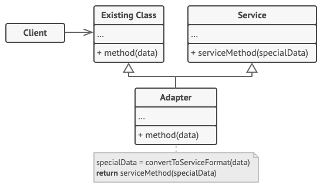

# Adapter Design Pattern

## Definition

Adapter is a structural design pattern that allows objects with incompatible interfaces to collaborate.

### Object adapter
This implementation uses the object composition principle: the adapter implements the interface of one object and wraps the other one. It can be implemented in all popular programming languages.

### Class adapter
This implementation uses inheritance: the adapter inherits interfaces from both objects at the same time.

## Example
### How to push a square peg through a hole

In this example we simulate current state where whe hava a hole of specific size and a round peg that can or cannot go through it.
Adapter pattern answers the question: what if we would have a square peg? Will it fit and go through the hole?

Answer is calculate by Adapter that inherits from RoundPeg class (is) and keeps reference to SquarePeg object as a field (has).

## Other

- Example is from awesome website [Refactoring Guru](https://refactoring.guru)

